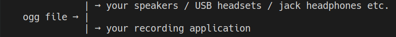

# Fake Microphone Wav Player


Fake is a pulseaudio client that can inject wav files like a microphone to any recording app on linux.


# Suckless building 

  - Like suckless apps, Fake can be built with just `make`
  - You'll get a single executable.

# How does it work
 - Fake creates a virtual empty sink and a virtual combined sink. Pulseaudio sinks are basically just the devices in which you can output sound, it can be your USB headphones, you speakers or some virtual stuff. In our case, the empty sink is connected to no "real hardware". The combined sink forwards its audio to its slave sinks. This combination feature of pulseaudio is used to be able to play the wav file both in the virtual sink and in "real hardware" sinks so that you can also hear what is played.
 - Then fake connects the source stream of your application(=source-output in PulseAudio terminolgy) to the source of the virtual sink (the monitor of the virtual sink to be exact). Now everything that is played in the virtual sink enters the recording of your application.
 - Now fake can just play the wav file to the combined sink.
 - To summarize :


# Usage
## The GUI Way
If you prefer using a GUI, you can use Control's for Fake GUI frontend. [Control's for Fake link](https://github.com/SCOTT-HAMILTON/ControlsForFake) .
	
## The hard way

`./FakeMicWavPlayer <WavFile> [pulseaudio sinks]`

  - The wav file is an audio file in PCM_S16_LE (PCM 16 bit integers little-endian)
  - The optional pulseaudio sinks is a comma separated list of pulseaudio sinks that you want Fake to play in alongside with the virtual sink. This option should be used if you want to hear the wav file played. To know which values you can put, plug the device you want to listen on (if it's not an internal device) and run `pactl list short sinks`. The second column of the table contains the names of all your devices. You just have to copy them. Here is an example : 
  
   > The output of pactl is for me : 
  
  ```
  1	alsa_output.pci-0000_00_1f.3.analog-stereo	module-alsa-card.c	s32le 2ch 44100Hz	SUSPENDED
  9	alsa_output.usb-Sennheiser_Sennheiser_SC60_for_Lync_55ef416267-00.analog-stereo module-alsa-card.c	s16le 2ch 44100Hz	SUSPENDED
  ```
  
   > So if I wan't to hear the wav on my sennheiser headsets and on my internal speakers, I would run : 
  
  ```./FakeMicWavPlayer MyWav.wav alsa_output.pci-0000_00_1f.3.analog-stereo,alsa_output.usb-Sennheiser_Sennheiser_SC60_for_Lync_55ef416267-00.analog-stereo```
  


### Change the recording application

By default Fake will try to find the Discord app recording but you can change that easily.

 - The application is hard coded in the first lines of codes of the `main.c` file : 
```c
#include "player.h"

...

// User defined control fields
static const char* sourceProcessBinary          = "Discord";
```
 - This is the process binary of your application. To know which value you should replace it with, start the recording on your application, run `pactl list source-outputs | grep application.process.binary`. You should have a list of all the app binaries that are recording. If I run discord's mic test, I get this output from pactl : 

```	
	application.process.binary = "Discord"
```
	The value that I would take is the app binary in the double-quotes.
 - Now that you know which value to use, you can replace the one in `main.c` to yours.
 - Finally you can recompile with `make`

### Requirements

Fake requires libpulse : 
On debian : 
```sh
# apt install libpulse-dev -y
```

On openSuse : 
```sh
# zypper in libpulse-devel
```

On fedora

```sh
# dnf install pulseaudio-libs
```

On centos

```sh
# yum install pulseaudio-libs
```

On mageia

```sh
# dnf install libpulseaudio-devel
```

On openMandriva

```sh
# urpmi lib64pulseaudio
```

On clearlinux

```sh
# swupd bundle-add devpkg-pulseaudio
```

On archlinux

```sh
# pacman -S libpulse
```

On alpinelinux

```sh
# apk add libpulse
```

On void linux

```sh
# xbps-install -S libpulseaudio
```

On gentoo

```sh
# emerge media-sound/pulseaudio
```


### Help

Fake is just a little project, but feel free to fork, change, extend or correct the code.


License
----
Fake is delivered as it is under the well known MIT License


**References that helped**
 - [pulseaudio IRC] : <#pulseaudio>
 - [pulseaudio under the hood] : <https://gavv.github.io/articles/pulseaudio-under-the-hood/>
 - [pulseaudio documentation] : <https://freedesktop.org/software/pulseaudio/doxygen/>
 - [pulseaudio introspect API interface] :
   <https://freedesktop.org/software/pulseaudio/doxygen/introspect_8h.html>

[//]: # (These are reference links used in the body of this note and get stripped out when the markdown processor does its job. There is no need to format nicely because it shouldn't be seen. Thanks SO - http://stackoverflow.com/questions/4823468/store-comments-in-markdown-syntax)


   [pulseaudio IRC]: <#pulseaudio>
   [pulseaudio under the hood]: <https://gavv.github.io/articles/pulseaudio-under-the-hood/>
   [pulseaudio documentation]: <https://freedesktop.org/software/pulseaudio/doxygen/>
   [pulseaudio introspect API interface]:
   <https://freedesktop.org/software/pulseaudio/doxygen/introspect_8h.html>
